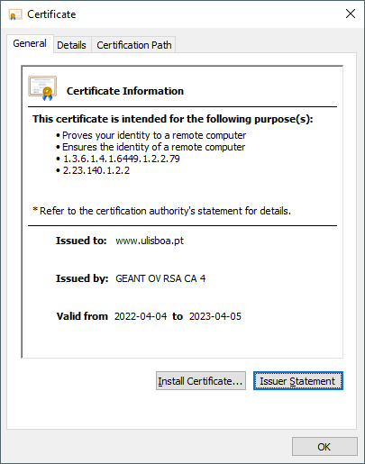
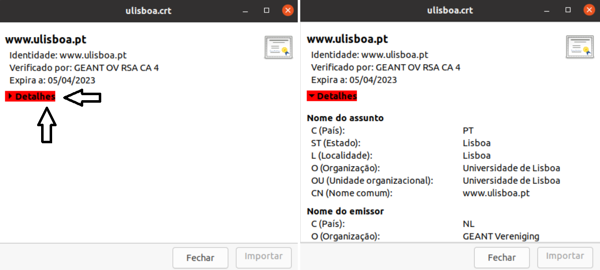
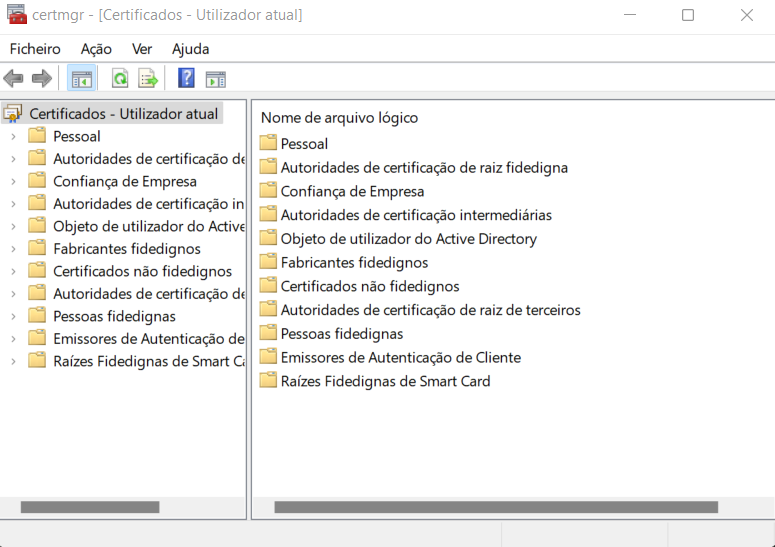

Instituto Superior Técnico, Universidade de Lisboa

**Segurança Informática em Redes e Sistemas**

# Guião de laboratório: Criptografia com OpenSSL

## Objectivo

O objetivo deste guia é aprofundar os conhecimentos sobre criptografia.
O [OpenSSL](https://www.openssl.org/) é, como o nome sugere, uma implementação aberta do protocolo SSL/TLS (*Secure Sockets Layer*/*Transport Layer Security*).
No entanto, oferece também uma biblioteca para programação e comandos de linha que permitem utilizar diversos os algoritmos criptográficos.

---

## Exercício 1 – Criptografia simétrica

O primeiro exercício consiste em cifrar e decifrar um ficheiro usando criptografia simétrica.

1. Todas as operações que vamos realizar usam o comando de linha `openssl`.
Comece por ver que está disponível o manual desse comando correndo `man openssl`.
Pode também aceder aos manuais dos subcomandos usando `man`, p.ex., `man enc` para o subcomando `openssl enc`.

2. Observe os algoritmos de criptografia simétrica disponíveis executando:  
    `openssl list -cipher-commands`  
Pode observar variações de algoritmos como AES (Advanced Encryption Standard, a norma norte-americana atual), DES, RC2, RC4, Blowfish (bf), Camellia.
Note que nem todos os resultados são realmente algoritmos criptográficos, p.ex., _base64_ é uma forma de codificação de binário em caracteres de texto e não um algoritmo criptográfico.

3. Crie um ficheiro com o nome `texto.txt` e 10 linhas todas com o conteúdo `Texto em claro!`.

4. Vamos cifrar esse ficheiro como uma cifra de blocos, AES, com uma chave de 256 bits no modo em que cada bloco é cifrado independentemente, ou seja, modo ECB (_electronic codebook_).
O OpenSSL designa esse algoritmo/modo de cifra por _aes-256-ecb._
Para cifrar qualquer coisa é preciso ter uma chave criptográfica.
Uma solução prática para obter uma chave consiste em gerá-la a partir de uma _password_ (ou _passphrase_).
O comando `openssl enc` gera uma chave a partir de uma _password_ que pede ao utilizador.
Execute o seguinte comando:  
`openssl aes-256-ecb -in texto.txt -out texto.enc`

Veja o conteúdo do ficheiro cifrado executando `cat texto.enc`.
Como pode observar, o conteúdo é incompreensível.

5. Decifre o ficheiro usando o seguinte comando, e observe como os dois ficheiros de texto são iguais:  
`openssl aes-256-ecb -d -in texto.enc -out texto-decifrado.txt`

6. Observe o conteúdo do ficheiro `texto.enc` usando o comando `hexdump` (corra `man hexdump` se não souber para que serve). 
Use a opção `-v` para ver o ficheiro completo: `hexdump -v -C texto.enc`
Veja como no ficheiro `texto.enc` há um padrão visível. Como aes é uma bijeção, um atacante consegue inferir que o conteúdo desses blocos é igual, apesar de não conseguir descobrir qual o conteúdo desses blocos.
Esta é a razão pela qual não se deve usar o modo ECB se não quisermos dar esta informção.

7. Vamos então cifrar novamente o ficheiro usando o modo CBC (*Cipher Block Chaining*).
Execute:  
`openssl aes-256-cbc -in texto.txt -out texto.enc`  
Veja o conteúdo do ficheiro `texto.enc` com o comando `hexdump` e repare como já não há um padrão observável.

8. Decifre o ficheiro executando o comando:  
`openssl aes-256-cbc -d -in texto.enc -out texto-decifrado.txt`  
Observe como os dois ficheiros de texto são iguais.

9. No modo CBC além da chave é preciso fornecer um IV (_initialization vector_).
Neste caso, este valor é também gerado a partir da _password_.
Observe a chave e o IV gerados (em hexadecimal) usando o comando:  
`openssl aes-256-cbc -P`  
Quantos bits têm a chave e o IV?
Lembre-se de que cada caracter hexadecimal representa 4 bits.

10. O uso de uma _password_ para gerar chaves criptográficas pode ser inseguro.
Por exemplo, o algoritmo AES usa uma chave de 128 ou 256 bits, o que é considerado seguro.
No entanto, se a _password_ tiver poucos caracteres, p.ex., 8, o número de chaves diferentes que se podem gerar é de apenas 64^8 = 2^48 (considerando 64 caracteres diferentes), o que é muito menos do que o número de chaves de 128 bits disponíveis, que é de 2^128.
Pode observar quantos blocos `aes` o seu processador pode cifrar por segundo num unico core correndo:
`openssl speed aes`
Quais as implicações de usar uma chave curta? Ie, o que aconteceria se a chave tivesse apenas 8 bits?
Quanto tempo demoraria um ataque de força bruta a uma chave de 8 bits usando uma máquina igual à sua? E 1000 máquinas?


11. Como é que se sabe se uma _password_ tem tamanho suficiente?
A regra é que o número de bits efectivo (NBE) da _password_ tem de ser maior ou igual ao número de bits da chave.
O NBE de uma _password_ é dado por:  
$NBE = log 2 (n^m)$ – sendo _n_ o número de caracteres disponíveis e _m_ o tamanho da _password._
Considerando 64 caracteres disponíveis (26 letras maiúsculas, 26 minúsculas, 10 números, mais 2 caracteres quaisquer), que tamanho deve ter a _password_ para uma chave de 128 bits?
No caso de ser usado um IV, o número de bits efectivo da _password_ deve ser maior ou igual ao número de bits da chave mais o IV.

---

## Exercício 2 - Criptografia de chave pública

Neste exercício vamos criar e verificar assinaturas digitais, o que exige o uso de criptografia de chave pública.

1. Gere um par de chaves RSA com um módulo de 1024 bits usando o seguinte comando:  
`openssl genpkey -algorithm RSA -pkeyopt rsa_keygen_bits:1024 -aes-256-cbc -out mykey.pem`  
Este comando guarda as chaves no ficheiro `mykey.pem` que, dada a importância da chave    privada, é cifrado usando o algoritmo AES em modo CBC com uma chave de 256 bits derivada da _password_ que é pedida.

2. Extraia a chave pública para o ficheiro `pubkey.pem` usando o comando:  
`openssl pkey -in mykey.pem -out pubkey.pem -pubout`  
Note que a _password_ diz respeito ao ficheiro `mykey.pem`;
o ficheiro da chave pública não é cifrado.

3. Observe o conteúdo dos ficheiros gerados usando o comando `cat`.
Note que as chaves estão codificadas em base 64.
Veja os diversos parâmetros que compõem as chaves usando os comandos:  
`openssl pkey -in mykey.pem -text`  
`openssl pkey -in pubkey.pem -pubin -text`

4. Para assinar um ficheiro ou uma mensagem, é necessário calcular a sua síntese criptográfica ou _hash_.
Pode obter um _hash_ do ficheiro `texto.txt` usando o seguinte comando:  
`openssl dgst -sha1 texto.txt`

5. A opção `- sha1` designa o algoritmo de _hash_ SHA1.
Podem ser usados outros. Veja quais através do comando:  
`openssl list -digest-commands`

6. O resultado do ponto anterior não é ainda uma assinatura, porque uma síntese não tem segredos.
No entanto, o comando `openssl dgst` também serve para gerar assinaturas.
Execute:  
`openssl dgst -sha1 -sign mykey.pem -out sign.bin texto.txt`  
A assinatura é guardada no ficheiro `sign.bin`.

7. Imagine que o ficheiro `texto.txt`, a assinatura `sign.bin` e a chave pública (ficheiro    `pubkey.pem`) são passados a outra entidade que pretende verificar se o ficheiro foi modificado. 
Essa entidade pode verificar a assinatura correndo o comando:  
`openssl dgst -sha1 -verify pubkey.pem -signature sign.bin texto.txt`  
Corra o comando e observe o resultado.

8. Modifique o ficheiro `texto.txt`, p.ex., apagando um caracter.
Execute novamente o comando da alínea anterior e observe o resultado.

---

## Exercício 3 – Sínteses de ficheiros

O Linux tem comandos para gerar e verificar sínteses de ficheiros.
Esses comandos são úteis para verificar se os ficheiros não foram corrompidos no disco ou quando transferidos de/para outro computador. O nome dos comandos varia com o algoritmo de _hash_: _md5sum_, _sha1sum_, _sha224sum_, _sha256sum_, _sha384sum_ e _sha512sum_.

1. Calcule a síntese MD5 do ficheiro `texto.txt` executando:  
`md5sum texto.txt > hfile`  
Veja o _hash_ fazendo `cat hfile`.

2. Verifique o _hash_ executando:  
`md5sum -c hfile`

3. Calcule a síntese SHA1 de todos os ficheiro da directoria executando:  
`sha1sum * > hfile`  
e verifique executando:  
`sha1sum -c hfile`

4. Essas funções de síntese (hash) têm uma propriedade que permite detetar se os ficheiros foram corrompidos.
Qual o nome dessa propriedade?
Seria possível recuperar os ficheiros baseados na síntese?

5. Assumindo que apenas um bit de um ficheiro foi trocado, proponha um algoritmo para recuperar o ficheiro original dado o *hash* original e o ficheiro com um bit trocado.
Qual a complexidade do seu algoritmo?

6. Calcule a síntese MD5 dos ficheiros `ship.jpg` e `plane.jpg`.
O que observou?

7. O resultado do cálculo anterior não foi uma coincidência.
Os ficheiros foram gerados ao mesmo tempo com o objetivo de terem o mesmo *hash*.
Que propriedade do MD5 foi quebrada?
Investigue a dificuldade deste ataque (quanto tempo demora) para o MD5 e para SHA1.

8. Como poderia usar o ataque acima para forjar uma assinatura digital?
Dado o ataque anterior, quais as implicações, no âmbito legal, de usar MD5/SHA1 em assinaturas digitais?

9. Para MD5 e SHA1 arbitrários, qual a dificuldade do melhor ataque de *preimage* conhecido atualmente?

---

## Exercício 4 - Certificados Digitais

A certificação digital é bastante usada na distribuição de chaves públicas e consiste na emissão de um certificado digital, por parte de uma Entidade Certificadora (EC) confiável, que associa uma determinada entidade a uma chave pública, o que permite assegurar dois principios vitais da comunicação em redes informáticas: a autenticação (uma entidade pode provar que é quem diz ser) e o não-repúdio (uma entidade não pode negar ter realizado uma ação).
Este exercício consiste na análise de um certicado digital do tipo X.509, focando nalguns aspetos essenciais da certificação digital, e na sua cadeia de distribuição.
Para isso usaremos o ficheiro `ulisboa.crt` que contém um certificado digital descarregado a partir da página *web* da Universidade de Lisboa, que implementa o protocolo HTTPS e por isso usa a certificação digital para se autenticar perante os seus visitantes.

Comece por abrir o ficheiro `ulisboa.crt` e analise os seus conteúdos.

Se editar com um editor de texto, o que vai ver terá o seguinte aspeto.

```
-----BEGIN CERTIFICATE-----
MIIHiTCCBXGgAwIBAgIQUq5qBoTj1FkUpDQAuWd8ODANBgkqhkiG9w0BAQwFADBE
...
HwPfhh43Wj/72c6h9g==
-----END CERTIFICATE-----
```

No Windows, abra com o Explorer, e depois fazendo duplo-clique no ícone do ficheiro.



No Linux faça um duplo-clique no ficheiro e de seguida carregue em "Detalhes" para visualizar os campos do certificado.



1. Que entidade produziu o certicado? Para que entidade foi o certicado produzido e qual a sua chave pública?

<!-- A entidade CA que produziu o ceritifcado foi a GEANT OV RSA CA 4 que emitiu o certificado para www.ulisboa.pt com chave pública:
30 82 01 0a 02 82 01 01 00 9c 00 95 9e 28 24 92 a8 91 b9 2d 01 e2 d6 46 57 d1 01 38 5f c4 c6 e6 04 32 78 51 0a a0 52 39 7b a8 f1 05 47 38 c7 03 ca 79 5a b6 98 f6 6f f5 04 55 48 1b b7 34 2c 6c bf 96 38 84 ae a6 5e 35 68 68 aa ca 71 c8 4e 6c a6 85 55 f9 9c df 15 5b fc e7 e2 97 2c 2e f6 4b 6b 91 f7 e5 4c 2f a2 24 5d 56 00 9d b6 73 6c d9 31 bd f4 56 37 88 b8 fd 3e 7f ff ab c2 5f ad 6b 96 2b b9 3c 80 53 da a9 89 12 3d f3 f6 19 c8 ef 32 7d 6e 73 eb fb d5 dc e7 85 f5 62 03 79 fb 14 74 9e c1 9a e9 ed 26 cb 32 21 8d f8 81 3a 13 4c 40 43 2b c0 92 ff 6a ef f3 ab d6 97 81 39 75 85 fc 53 76 0e 5a e3 53 5b 8a c0 af 6f c1 61 ca 09 8b 86 4e c5 39 3a 07 e5 33 f1 18 f1 6d 61 36 73 e0 cb b0 df 51 97 21 00 ab 56 6a c3 d6 4e 2c b7 2c 78 ca ee f5 f2 81 77 3d 51 3a c1 48 c6 c6 35 fc 84 02 9f f2 e8 8c f7 a5 02 03 01 00 01-->

Os certificados têm um prazo de validade limitado.
O tempo de duração do certificado é controlado de 2 formas: através de datas indicadas nos próprio certificado, ou através da emissão de um certificado de revogação. Um certificado de revogação é um certificado válido emitido por uma EC, onde se estabelece que a associação entre uma entidade e uma chave pública deixa de ser válida.

2. A partir de que data o certificado ficou válido? E a partir de que data a validade do certificado expira?

<!-- Ficou válido desde 04/04/2022 e fica válido até 05/04/2023-->

3. Que algoritmos foram usados no cálculo da assinatura digital do certificado?  Qual é a necessidade de haver uma assinatura digital no certificado?

<!--O algoritmo de digest da assinatura usado foi o sha384 e o algoritmo de chaves assimétricas foi o RSA. Tem que haver uma assinatura digital por parte de uma CA globalmente conhecida para a chave pública dessa entidade a quem foi emitida o ceritificado ser credível fazendo com qualquer pessoa que aceda a este ceritifcado saiba que essa chave públic é dessa entidade.-->

4. Que chave foi usada para assinar este certificado?
Que chave precisa o importador do certificado de ter, para validar a assinatura digital do certificado?

<!-- A chave usada para assinar este certificado foi a chave privada da CA logo o importador do certificado precisa de ter a chave públic da CA para verificar que essa entidade é credível pois percebe-se que foi a CA que emitiu aquele certificado -->

Imaginemos que a Entidade Certificadora X produziu este certificado.
O facto de o importador do certificado precisar de ter a chave pública da EC X para validar a assinatura digital, é preciso que se obtenha o certificado de chave pública da EC X emitido por outra EC Y, é preciso ter o certificado de chave pública da EC Y, por outra EC Z, e assim sucessivamente, até chegar a uma EC de raíz.
A validação de todos os certificados usando chaves públicas por outros certificados é chamada de cadeia de certificação.
O processo de validar um certificado implica que se valide toda esta cadeia que termina quando se atinge um certificado autocertificado, por uma EC com chave pública conhecida.

É possível analisar a cadeia de certificação de um certificado e ver todos os certificados que a formam. No Windows, basta abrir o certificado e abrir o separador "Caminho da certificação".

5. Quantos certificados formam a cadeia de certificação? Quantos certificados intermédios existem?

Qual é o certificado-raíz?

<!-- Na cadeia de certificação existem 3 certificados. GEANT OV RSA CA 4 é o certificado intermédio e a Sectigo é o certificado-raíz.-->

6. Para cada certificado verifique o emissor do certificado e a entidade para a qual o certificado foi criado.

Que EC emitiu o certificado-raíz?

<!--USERTrust RSA Certification Authority-->

Para que a validação de toda a cadeia possa ocorrer, os certificado-raíz confiáveis e os certificados intermediarios são guardados nos próprios sistemas operativos, ou muitas vezes, são incluidos no *software*, como é o caso de alguns *web browsers*.
No caso dos sistemas operativos, os certificados são guardados em ficheiros protegidos com permissões especiais, sendo possível modificar se tiver permissões para isso.
É possível visualizar os certificados, escrevendo "certmgr.msc" na powershell, ou pesquisar "cert" no ícone de pesquisa e selecionar a opção "Gerir certificados de utilizador", no caso do Windows, ou na pasta /etc/ssl/certs no caso de uma distribuição Linux.

Para windows:



Também é possível ver os certificados guardados num *browser*.
No caso do Firefox, é possível acedendo a definições -> privacidade e segurança -> gerir certificados.

7. Tente encontrar os certificados das entidades da cadeia de certificação observada anteriormente, no seu *browser* ou no seu *sistema operativo* de acordo com as instruções dadas acima.

## Referências

- OpenSSL, [http://www.openssl.org/](http://www.openssl.org/)

---
